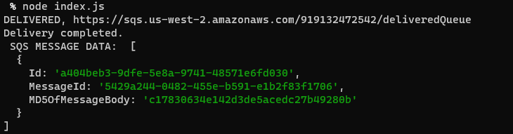

# caps-cloud

Using only AWS Services: SQS, SNS, and client applications, create a cloud version of a messaging/notification system.

## Getting started

1. clone the repo then `npm i` to install the dependecies
2. update your AWS credentials and permissions to allow full access to SNS and SQS
3. copy and paste your URL to the SNS and SQS variables
4. run the vendor, then you should see the messages being saved in your SNS and queued in SQS. 
5. run the driver-side code, you should see a success message and your vendor SQS being cleared

## UML

## Expected Output

Driver: 

Vendor:

